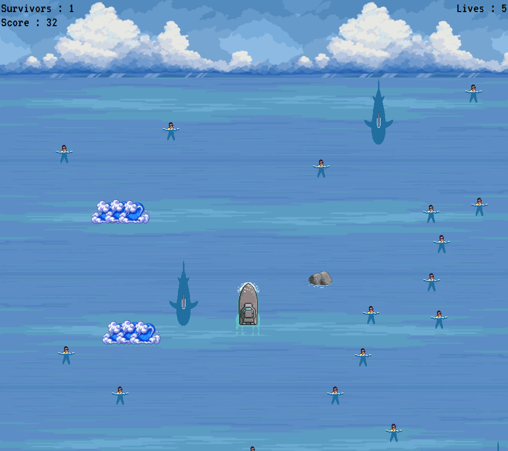

# Coastguard Game - An Ironhack Story

This is the first project of my [Ironhack](https://www.ironhack.com/fr-en/web-development/paris) journey - The Game.

## Table of contents

- [Overview](#overview)
  - [Screenshot](#screenshot)
  - [Context](#context)
  - [The challenge](#the-challenge)
  - [Deliverable Expected](#deliverable-expected)
  - [Links](#links)
- [My process](#my-process)
  - [Built with](#built-with)
  - [Useful resources](#useful-resources)
- [Author](#author)
- [Credit](#credit)

## Overview

### Screenshot

### Context

Ironhack has been training talent since 2013. With 7 campuses worldwide plus remote flexibility, more than 1,000 global hiring shares and over 12,500 student graduates; Ironhack trains in web development, web design, data analysis and cyber security. A single philosophy: “Learn by doing”. ironhack aims to have his learning experiences translated into real life experiences. [The aim of the web development bootcamp](https://www.ironhack.com/fr-en/web-development/paris) is to become a MERN Full-Stack developer (Mongo, Express, React, Node) via an intensive 3-module training program. 
- Module 1: Building Web development fundamentals and javascript mastery, validated by the creation of a game to run in the browser.
- Module 2: Improving your front-end skills with React integration, validated by the creation of an SPA capable of interacting with an external API.
Module 3: Building backend skills and advances full-stack development, validated by the development of a full web application as a final project using the MERN stack, simulating the real-life collaboration found in technology companies with the application of agile methodology and best practices.

### The challenge

Your challenge is to build a browser-based game using HTML, CSS, JavaScript, DOM manipulation, and Object-Oriented Programming (OOP).

The purpose of this project is to consolidate and practice all the knowledge you have acquired in this module. You may choose any game idea you like, but it must meet the technical requirements in this lesson.

Your game must meet the following technical requirements:

- Render a game in the browser.
- Have logic for winning and/or losing and show feedback to the player in either case (Your game must have logic that allows the player to win or lose).
- Your game code must be organized in separate files for HTML, CSS, and JavaScript.
- Use plain JavaScript for DOM manipulation.
- Your game entities and elements must be organized using classes and OOP.
- Have a repo on GitHub.
- Have at least one (1) commit per day that you worked on.
- You must deploy your game online using GitHub Pages so anyone can play it.
- Your code should follow the principles of KISS (Keep It Simple Stupid) and DRY (Don’t Repeat Yourself).

### Deliverable Expected

- A working game, built by you, that runs in the browser.
- Your game deployed on GitHub Pages and available online.
- The URL of the deployed game available online.
- The URL of the GitHub repository for your game.
- The URL of the slides for your project presentation.
- You must present your game during Module 1 project presentations (last day of Module 1 project).

### Links

- Live Site URL: [Click here](https://cannyro.github.io/coastguard/)
- Solution Repository URL: [Click here](https://github.com/CannyRo/coastguard)
- Slides Presentation URL: [Click here]()

## My process

### Built with

- Semantic HTML5 markup
- CSS custom properties
- OOP Javascript

### Useful resources

- [Link 1]() - .
- [Link 2]() - .

## Author

### Ronan CANNY

- GitHub - [@CannyRo](https://github.com/CannyRo)
- LinkedIn - [Ronan CANNY](https://www.linkedin.com/in/ronan-canny-b29443277/)

## Credit

